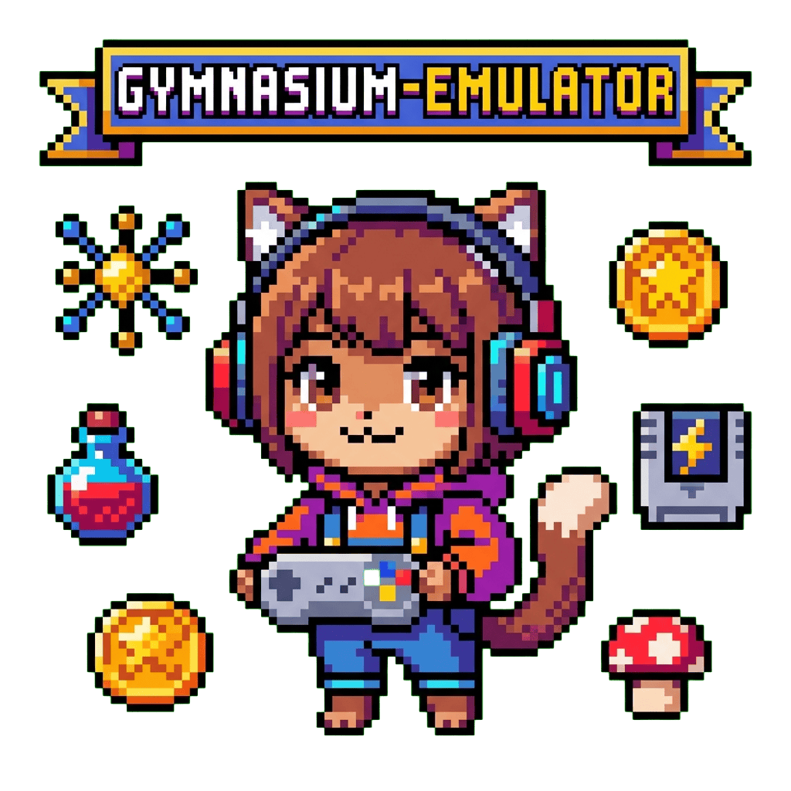

<div align="center">
  

  # gymemu

  [](LICENSE)
  [](https://python.org)
  [](https://pytorch.org)
  [](https://huggingface.co/tsilva)

  **🎮 Play retro games through learned latent dynamics—no ROM required 🧠**

  [How It Works](#how-it-works) · [Quick Start](#quick-start) · [Controls](#controls)
</div>

---

## Overview

Gymnasium Emulator visualizes and interacts with the latent dynamics of retro games using pre-trained deep learning models. Instead of traditional emulation, it uses a convolutional autoencoder to encode game frames into a 32-dimensional latent space and a dynamics model to predict how that state changes with each action.

The result: real-time gameplay powered entirely by neural networks.

## How It Works

```
┌─────────────┐     ┌──────────────┐     ┌─────────────┐
│  Keyboard   │ ──▶ │   Dynamics   │ ──▶ │   Decoder   │ ──▶ Display
│   Input     │     │    Model     │     │  (latent→   │
│ (9 actions) │     │ (Δ latent)   │     │   frame)    │
└─────────────┘     └──────────────┘     └─────────────┘
                           │
                    latent + Δlatent
                           │
                    ┌──────▼──────┐
                    │   Current   │
                    │   Latent    │
                    │   State     │
                    └─────────────┘
```

- **Autoencoder**: 3-layer convolutional network compresses 80×144 grayscale frames to 32 dimensions
- **Dynamics Model**: Predicts the *change* in latent space given an action (residual connection)
- **30 FPS**: Real-time visualization through Pygame

Models are downloaded automatically from Hugging Face at runtime.

## Quick Start

**Prerequisites**: Python 3.11+, NVIDIA GPU with CUDA support

```bash
# Clone and setup
git clone https://github.com/tsilva/gymemu.git
cd gymemu

# Create environment and install dependencies
python3 -m venv .venv
source .venv/bin/activate
pip install --extra-index-url https://download.pytorch.org/whl/cu118 -e .

# Configure Hugging Face token (only for pre-trained models)
cp .env.example .env
# Edit .env and add: HF_TOKEN=your-token

# Run with pre-trained models
python main.py
```

## Training Your Own Models

You can train neural emulator models on any Hugging Face dataset with the same format:

```bash
# Train on a dataset (e.g., Super Mario Bros)
python train.py \
    --dataset tsilva/gymnasium-recorder__SuperMarioBros_Nes_v0 \
    --epochs 50 \
    --batch-size 128 \
    --latent-dim 32 \
    --image-size 80
```

This creates two model files in `./models/`:
- `{dataset}-representation.pt` (autoencoder)
- `{dataset}-dynamics.pt` (dynamics model)

### Using Trained Models

Update `main.py` to use local models:

```python
# Line 17 in main.py
use_local_models = True  # Changed from False

# Line 9 in main.py - use sanitized dataset name
ds_id = "tsilva__gymnasium-recorder__SuperMarioBros_Nes_v0"
```

Then run: `python main.py`

### Training Configuration

| Argument | Default | Description |
|----------|---------|-------------|
| `--dataset` | Required | Hugging Face dataset ID |
| `--epochs` | 50 | Training epochs per phase |
| `--batch-size` | 128 | Batch size |
| `--latent-dim` | 32 | Latent space dimensionality |
| `--image-size` | 80 | Input image size (80×80) |
| `--output-dir` | ./models | Where to save models |

### Two-Phase Training

**Phase 1**: Autoencoder learns to compress game frames to latent space (L1 reconstruction loss)

**Phase 2**: Dynamics model learns to predict latent deltas given actions (MSE loss)

Validation runs every epoch for both phases, with best models saved automatically.

## Controls

| Key | Action |
|-----|--------|
| `Z` | A button |
| `X` | B button |
| `Q` | SELECT |
| `R` | START |
| `↑` `↓` `←` `→` | D-pad |

## Requirements

| Component | Requirement |
|-----------|-------------|
| Python | 3.11 |
| GPU | NVIDIA with CUDA 11.8+ |
| RAM | 8GB+ recommended |
| Dependencies | PyTorch, Pygame, PIL, NumPy |

## Project Structure

```
gymemu/
├── main.py           # Neural emulator inference (real-time gameplay)
├── train.py          # Training script for autoencoder and dynamics models
├── start.png         # Initial game frame (Tetris title screen)
├── pyproject.toml    # Project metadata and dependencies
├── .env.example      # Template for Hugging Face credentials
└── models/           # Trained models (created by train.py)
```

## License

[MIT](LICENSE) © 2025 Tiago Silva